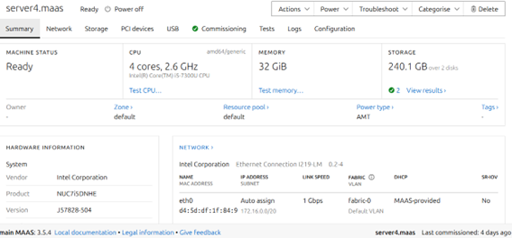

# roteiro 1
## objetivo 

Aqui neste primeiro roteiro o nosso objetivo e entender os conceitos básicos sobre uma plataforma de gerenciamento de hardware, além de introduzir os conceitos básicos de redes de computadore. Para atingirmos nossos objetivos, utilizaremos o maas, uma plataforma que gerencia dispositivos em nuvem.
## montagem do roteiro
### -tarefa1

Como é possível observar, para essa primeira tarefa criamos um banco de dados utilizando o **PostgreSQL** e implementando no **server 1**, e confirmamos que esse banco está funcionando, acessível na própria **server 1** e também a partir de uma conexão vinda da **main**, operando na porta `6734`.

### -Tarefa 2

Para essa tarefa 2, nós instalamos o maas e acessamos ele usando o ip http://10.103.1.27:5240/, além de termos sincronizado as imagens e cadastrado as maquinas do server1 ao server5.

### -tarefa 3

Para essa tarefa nos fizemos deploy do server 2 e criamos um túnel, para acessar o Django, a partir da porta 8001. - para poder instalar o Django eu primeiro entrei na minha  maquina server 2 usando o comando “ssh cloud@10.103.1.27 -L 8001: 172.16.7.150:8080”, porem meu Django não estava ainda funcionando, então entrei na pasta tasks utilizando “Cd tasks” eapos isso dentro da pasta tasks, usei o comando “install.sh” e “run.sh” que resolveu o problema da instalação e consegui entar no Django pelo link “http://localhost:8001/admin/” 

### -tarefa 4

Para esta atividade foi feito um exercício semelhante que fizemos na atividade 3 só que desta vez utilizamos o server 3 e criamos o túnel utilizando a porta 8002. Como e possível observar foi feito deploy do server 3 e agora podemos acessar o django da porta 8002.

### -tarefa 5

por fim, nessa ultima a tiva utilizamos o deploy no server 4, e modificando alguns arquivos, e crimaos uma ponte utilizando o server 4 que faz um get request dos server 1 e do server 2. Após acessar-mos o ip do server 4 temos um print do server 1 e do server 2.

## Discussões 

Ao decorrer do lab tive alguns obstáculos, principalmente quando alguma coisa dava errado, e não funcionava como deveria, tinha muita dificuldade para identificar e corrigir os erros, e muitas vezes fui ajudado pelo chat e pelos professores da matéria, contudo no final solucionei todas as minahs duvidas e consegui terminar o lab.

## Conclusão

Com a realização desse roteiro, foi possível concluir que redes de computadores e algo extremamente complexo, mas com aprendizado e sanando dúvidas foi possível instalr o maas e manipular as redes de acordo com nossos objetivos.