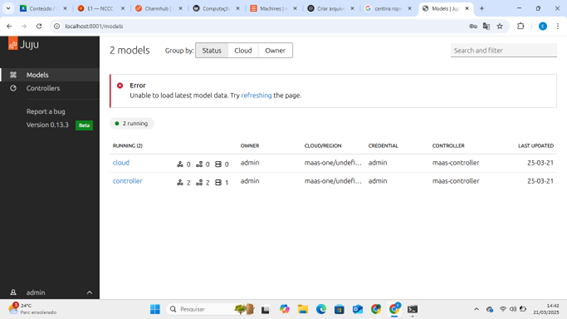

# roteiro 2
## objetivo 
agora que terminamos o nosso primeiro roteiro, e entedemos como funciona uma plataforma de gerenciamento de hardaware, agora nossa meta e entender como funciona uma plataforma de gerenciamento de aplicações distribuidas. alem disso entenderemos os conceitos basicos da comunicasção entre aplicação e serviços.

## montagem do roteiro
### -tarefa 1
para fazermos esse roteiro nos primeiro instalamosa nossa plataforma de gerenciamneto de aplicações, nesse caso o juju. apos insatalarmos e configurarmos o juju, nos utilizamos as aplicações grafana e prometheus, onde coma ajuda do juju fizemos o deploy do grafana e o integramos ao prometheus

como e possivel observar atraves dos prints  e possivel perceber que fizemos a instalaçõ do juju e conseguimos a cessar o dashboard, alem de fazermos funcionar o grafana e o prometheus.

## Discussões 
a execução desse lab foi relativamente mais facil, que o anterior principalmente por ser um roteiro com menos atividades e menos passos a serem executados. entretanto tivemos algumas bareiras ao fazer o reoteiro, mas  com um pouco de pesquisa e uma ajudinha foi possivel concluir o lab. 

## conclusão
ao terminarmos o lab estamos com a nossa plataforma de gerenciamento de aplicações distribuidas, o juju, instaldo e funcioando com as aplicações grafana e promethus integradas.
