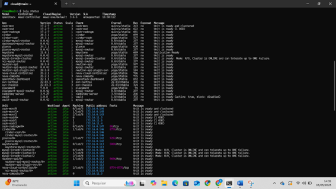
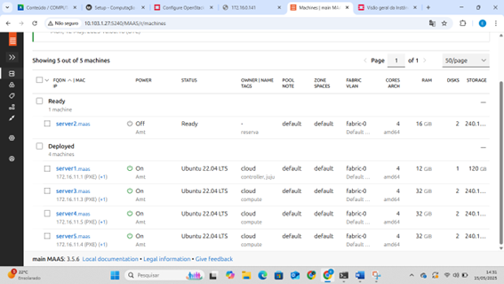
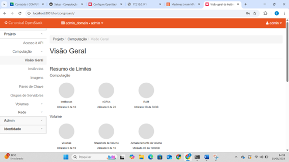
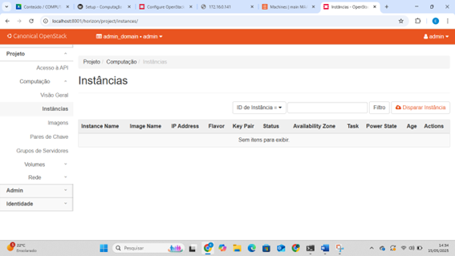
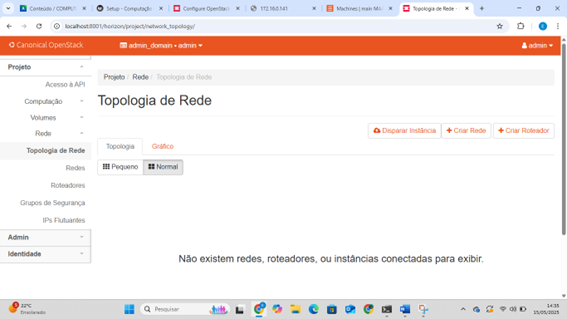
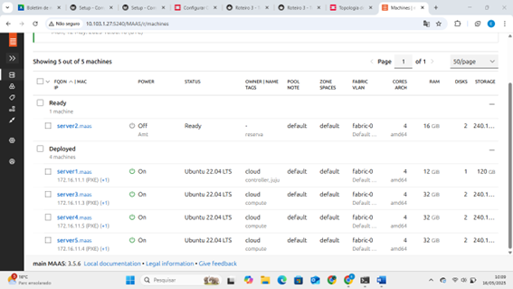
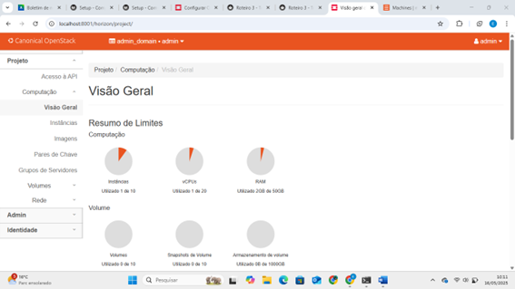
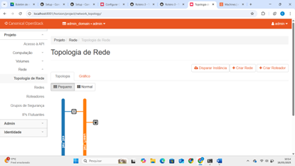
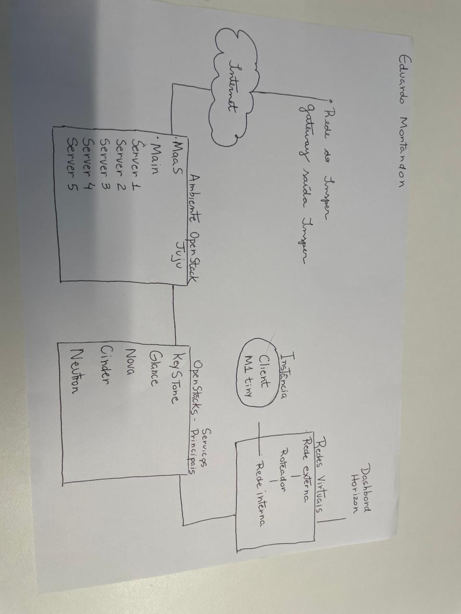

# roteiro 3
## objetivo
agora que estamos um pouco avançados, nesse roteiro o nosso principal objetivo e entender os conceitos basicos de private cloud e aprofundar os conceitos sobre redes virtuais
## montagem do roteiro
### -tarefa1

como e possivel pereceber nessa primeira tarefa instalamos o nosso openstack, e conseguimos atraves de um tunel acessar o seu dashboard. ate esse ponto do projeto não implementamos nenhuma instancia e não configuramos nenhuma rede, logo as abas "instances" e "topology" do nosso dashboard do openstack estão vazias.

### -tarefa2

seguindo na nossa implementação, nos conseguimos disparar nossa instancia, e configuramos a rede externa e interna, e as conectaos atraves de um roteador. a partir dos prints percebemos que na aba "instances" que nossa instancia foi alocada, e tambem atraves da aba "topology" vemos o esquema da nossa rede, com a rede externa, interna e o roeteador.

### -tarefa3
antes de concluirmos fizemos um desenho de toda a arquitetura da nossa rede, desde de aconexão insper ate a instancia alocada

 
## Discussões 
esse sem sobra de duvida, foi o roeteiro mais dificila a ser implementado, e apenas com muita persistencia e esforço que foi possivel conclui-lo a tempo de poder entregar.

# Conclusão

apos concluir esse roteiro, criamos a nossa infra de cloud com as instancia e a nossa rede, alem levantarmos aplicações no openstack.
