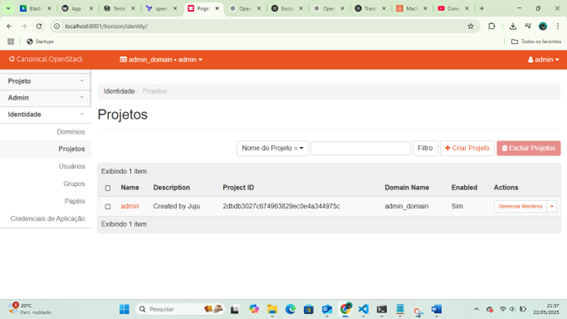
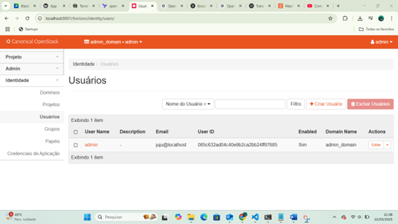
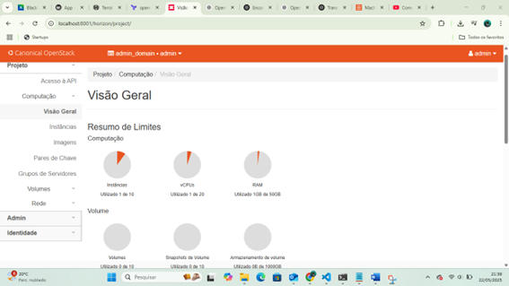
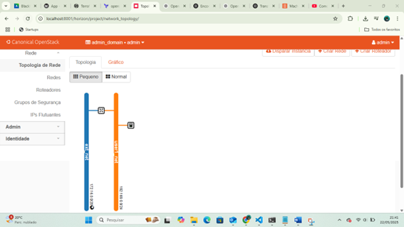

# roteiro 4
## objetivo 
agora que estamos quase finalizando o nosso curso, nesse ultimo roteiro o nosso objetivo é entender os conceitos basicos sobre sla e rdr e de infraetutura como código

## montagem do roteiro
### -tarefa1
para fazermos a infraetutura como codigo(iac) primeiro precisamos exscolher qual plataforma de iac iremos utilizar e a nossa plataforma escolhida é a terraform. primeiro instalamos o terraform, e a aprtir do terminal criamos do toda a infraestutura com o teraform e arquivos .tf que definem a infraestrutura. logo, fizemos a aplicação da nossa infraestrutura 
  
  
 
 
 
como e possivel perceber atraves dos prints, conseguimos implemaentar nossa estrutura com o terraform

## Discussões 
esse em geral foi o roteiro mais simples e facil de fazer, e em apenas 1 dia foi possivel instalçr o terraform e fazer a aplicação.

## conclusão
ao terminarmos o roteiro temos o terraform instalado e conseguimos fazer a definiçao da infraestrutura atraves do mesmo.